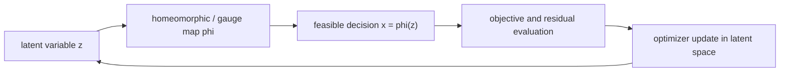

# Homeomorphic Optimization

A user-facing guide and Python package for understanding and running
homeomorphic methods for constrained optimization.

Homeomorphic optimization turns constrained problems into easier search
problems by optimizing in a latent space and mapping every latent iterate back
to the feasible region. The main idea is simple:

```text
original constrained problem:       minimize f(x) subject to x in C

homeomorphic reformulation:         choose x = phi(z), where phi(z) is feasible
                                    minimize f(phi(z)) over unconstrained z
```

When the map `phi` is chosen well, optimization steps can move freely in
latent coordinates while the corresponding decision variables remain feasible
or much easier to repair.

## What This Repository Is For

This repository is for users who want to:

- understand how homeomorphic maps help constrained optimization;
- run reproducible experiments for Hom-PGD, Hom-ALM, INN-PGD, and baselines;
- use the `homopt` package as a research framework for new constrained
  optimization problems;
- compare homeomorphic methods with projected-gradient, augmented-Lagrangian,
  manifold, and solver-based baselines.

The package is organized around runnable examples and experiment scripts. You
can start from a script, inspect the method configuration, and trace the call
into the shared Python package under `src/homopt`.

## Core Intuition

Many optimization methods update a decision variable and then correct it:

```text
take a step -> violate constraints -> project or penalize -> repeat
```

Homeomorphic methods instead try to encode the feasible geometry directly:

```text
take a latent step -> map to feasible point -> evaluate objective -> repeat
```

This changes the role of constraints. Instead of being an after-the-fact
correction, they become part of the parameterization of the search space.



## Method Families

| Family | Use When | Main Idea |
| --- | --- | --- |
| `Hom-PGD` | Inequality constraints define a convex or star-shaped feasible set | Optimize in latent coordinates through a gauge or star map instead of repeatedly projecting in decision space. |
| `Hom-ALM` | The problem has equalities plus explicit inequality constraints | Use a homeomorphic map for inequalities and an augmented-Lagrangian loop for equalities. |
| `Prox-Hom-ALM` / `Hom-PALM` | Equality-constrained problems need stronger outer-loop stabilization | Add a proximal term to the Hom-ALM outer method. |
| `INN-PGD` | The feasible map is learned for a parametric problem family | Train an invertible neural network and run projected or latent optimization through the learned map. |
| Classical baselines | You need reference comparisons | Includes PGD, FW, RD, ALM, proximal penalty methods, Stiefel retraction baselines, CVXPY/Pyomo/IPOPT routes, and problem-specific solvers. |

## Package Layout

```text
src/homopt/
  problems/       Problem definitions: convex/SOCP, QCQP, Stiefel, JCC/OPF
  mappings/       Gauge maps, star maps, and homeomorphic parameterizations
  optim/          Optimizer loops and method dispatch
  models/         INN models and flow components
  learning/       Predictor and post-processing interfaces
  solvers/        Exact, convex, manifold, and OPF solver wrappers
  experiments/    Reproducible experiment workloads and result persistence
  viz/            Plotting, trace normalization, and artifact helpers

scripts/
  hom_pgd/                Hom-PGD inequality experiments
  hom_alm/                Hom-ALM equality plus inequality experiments
  inn_pgd/                INN-PGD experiments
  learning_postprocess/   Predictor plus post-processing experiments

docs/             Architecture, algorithm notes, and reproduction guides
tests/            Regression tests and package boundary checks
```

## Installation

Clone the repository and install the package in editable mode:

```bash
git clone https://github.com/<user-or-org>/Homeomorphic-Optimization.git
cd Homeomorphic-Optimization
pip install -e .
```

For development and experiments:

```bash
pip install -e .[dev,research,solvers,viz,models]
```

The local research environment used by the project is a conda environment named
`ML`:

```bash
conda run --no-capture-output -n ML python -m pytest -q tests
```

If you are only reading the tutorial or running lightweight examples, start
with the base install. Solver-heavy experiments may require optional packages
such as CVXPY, Pyomo, IPOPT, or power-system dependencies.

## Quick Start

Run a small Hom-ALM comparison:

```bash
python scripts/hom_alm/run_convex_eq_compare.py
```

Run an inequality-only Hom-PGD comparison:

```bash
python scripts/hom_pgd/run_convex_ineq_compare.py
```

Run a QCQP INN-PGD experiment:

```bash
python scripts/inn_pgd/run_qcqp_inn_compare.py
```

Run tests:

```bash
python -m pytest -q tests
```

Experiment scripts write results under `results/<family>/...`. A typical run
stores:

```text
config.json      # run configuration
result.json      # compact metrics and summary payload
artifacts/       # traces, figures, records, and method-specific outputs
```

## Choosing a Starting Point

| Goal | Start Here |
| --- | --- |
| Learn the main idea | Read this README, then inspect `docs/algorithm_notes.md`. |
| Understand the package structure | Read `docs/architecture.md`. |
| Reproduce current experiments | Read `docs/reproduce_experiments.md`. |
| Add a new problem type | Start from `src/homopt/problems/` and an existing experiment workload. |
| Add a new optimizer | Start from `src/homopt/optim/dispatch.py` and the optimizer modules in `src/homopt/optim/`. |
| Add a new experiment script | Follow the family structure under `scripts/`. |
| Compare methods on one instance | Use Hom-PGD or Hom-ALM scripts and inspect stored `artifacts/records/`. |
| Train or evaluate learned feasible maps | Use the INN-PGD scripts under `scripts/inn_pgd/`. |

## Conceptual Map

Homeomorphic optimization in this package is built around three separations:

1. **Problem**
   Defines the objective, constraints, gradients, and reference solve when
   available.

2. **Map**
   Converts a latent variable into a decision variable that respects the target
   geometry, usually through a gauge, star, or learned invertible map.

3. **Optimizer**
   Updates the latent or decision variable, records traces, and exposes
   comparable metrics across methods.

This separation lets a user swap methods without rewriting the problem, and
lets new experiments share a common result schema.

## Main Experiments

| Experiment | Script | Purpose |
| --- | --- | --- |
| Convex inequality comparison | `scripts/hom_pgd/run_convex_ineq_compare.py` | Compare Hom-PGD against first-order inequality baselines. |
| Convex equality plus inequality comparison | `scripts/hom_alm/run_convex_eq_compare.py` | Compare Hom-ALM and ALM-style methods. |
| Stiefel constrained subspace learning | `scripts/hom_alm/run_stiefel_eq_compare.py` | Compare Hom-ALM with manifold and solver baselines. |
| QCQP INN-PGD | `scripts/inn_pgd/run_qcqp_inn_compare.py` | Train or load a learned feasible map and compare on QCQP instances. |
| QCQP INN-PGD toy visualization | `scripts/inn_pgd/run_qcqp_inn_toy.py` | Inspect 2D trajectories and map behavior. |
| JCC/OPF INN-PGD | `scripts/inn_pgd/run_jcc_opf_compare.py` | Compare INN-PGD and solver/penalty baselines on chance-constrained OPF. |
| Predictor plus post-processing | `scripts/learning_postprocess/run_qcqp_predictor_postprocess.py` | Compare neural prediction with optimization-based repair. |

## Result Artifacts

Comparison workflows use a manifest-backed artifact layout:

```text
artifacts/
  manifest.json
  summary.json
  records/
    <method>.npy
```

Use `summary.json` for compact method-level metrics and `records/<method>.npy`
for full iteration traces. Training caches, model checkpoints, and large local
outputs should remain outside the lightweight result summaries intended for
sharing.

## Documentation

- `docs/architecture.md`: package structure and module responsibilities.
- `docs/algorithm_notes.md`: method IDs, algorithm behavior, and active
  configuration rules.
- `docs/reproduce_experiments.md`: experiment map and reproduction workflow.
- `docs/experiment_guide.md`: extension patterns for new experiments.
- `docs/solver_notes.md`: solver routes and baseline compatibility.

## Status

This is a research package. The API is organized enough for reusable
experiments, but method internals and experiment defaults may still change as
the research code evolves. Prefer script-level reproducibility over assuming
that every internal helper is stable.

## Citation

If this repository supports your research, cite the associated paper or project
artifact once it is available. A formal `CITATION.cff` can be added when the
public citation target is finalized.

## License

No open-source license is included yet. Until a license is added, treat the
code as private research code rather than redistributable open-source software.
