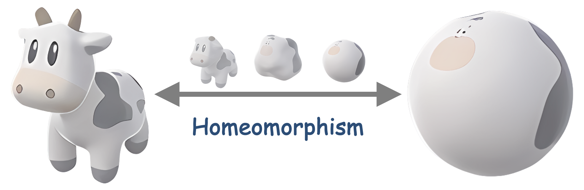
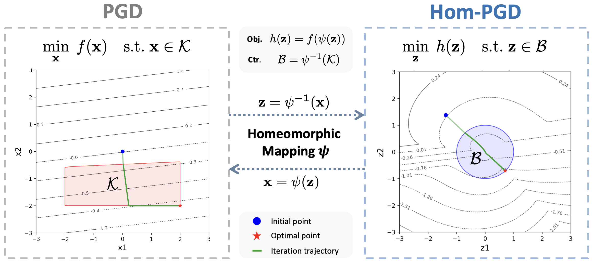

# Homeomorphic Optimization

[](#installation)
[](#requirements)
[](#hom-pgd)
[](#status)

<p align="center">
  
</p>

Homeomorphic Optimization is a research package for constrained optimization
with homeomorphic maps. The current public-facing focus is **Hom-PGD**, a
projection-free first-order method that optimizes in a latent space while a
homeomorphic or gauge map keeps decisions inside the target feasible set.

This README is written for users who want to understand Hom-PGD, run the
included experiments, and extend the codebase with new instances or algorithms.
Other methods are present in `src/homopt/`, but are intentionally not documented
in detail here yet.

## Installation

```bash
git clone https://github.com/<user-or-org>/Homeomorphic-Optimization.git
cd Homeomorphic-Optimization
pip install -e .
```

For experiment workflows:

```bash
pip install -e ".[dev,research,solvers,viz,models]"
```

### Requirements

- Python >= 3.7
- NumPy
- PyTorch
- Optional experiment dependencies: SciPy, NetworkX, CVXPY, Pyomo,
  Matplotlib, pandas, seaborn, torchvision, pypower

After installation, a quick import check is:

```bash
python -c "import homopt; from homopt.experiments.hom_pgd import convex_algorithm_comparison; print('homopt import OK')"
```

## Quick Start

Recommended first run:

```bash
python scripts/hom_pgd/run_poly_star_compare.py
```

This 2D poly/star experiment is small, visual, and useful for checking the full
workflow before moving to larger instances.

Then try:

```bash
python scripts/hom_pgd/run_convex_ineq_compare.py
python scripts/hom_pgd/run_maxcut_sdp_compare.py
```

Runs write outputs under `results/hom_pgd/`.

## Hom-PGD

Hom-PGD targets constrained problems of the form

$$
\begin{aligned}
\min_x \quad & f(x) \\
\text{s.t.} \quad & x \in \mathcal{C}.
\end{aligned}
$$

Instead of updating $x$ directly and projecting back to $\mathcal{C}$,
Hom-PGD introduces a latent variable $z$ and a feasible-set map

$$
x = \psi(z).
$$

The transformed objective is

$$
h(z) = f(\psi(z)),
$$

and the update is performed in latent space:

$$
\begin{aligned}
z_{k+1} &= z_k - \eta \nabla_z f(\psi(z_k)), \\
x_{k+1} &= \psi(z_{k+1}).
\end{aligned}
$$

<p align="center">
  
</p>

The main modeling object is the map $\psi$. In this repository, Hom-PGD
experiments cover:

- convex SOCP-style feasible regions through gauge maps;
- 2D polytope and star-shaped toy feasible sets;
- MaxCut SDP-style feasible regions;
- adversarial-attack feasible balls and weighted norm constraints.

### Gauge Mapping

`GaugeMap` is the main map used for convex inequality sets. It maps a latent
point `z` to a feasible decision by radially scaling from an interior center
`x0`. Equality constraints are not part of the gauge map; they are handled by
ALM/PALM-style layers.

The problem object supplies constraint tensors. A missing attribute or `None`
disables that constraint family.

| Family | Attributes | Form |
| --- | --- | --- |
| Linear | `A`, `b` | `A x <= b` |
| Box lower | `L` | `L <= x` |
| Box upper | `U` | `x <= U` |
| SOC | `G`, `h`, `C`, `d` | `||G_i x + h_i|| <= C_i x + d_i` |
| Quadratic | `Qq`, `pq`, `bq` | `0.5 x^T Q_i x + pq_i^T x <= bq_i` |

For each latent point, the map computes a ray direction and the active boundary
candidate:

$$
r = \|z\|_2, \qquad u = z / r, \qquad
\beta = \max_j \beta_j(u),
$$

then returns

$$
\psi(z) = x_0 + \frac{z}{\beta}.
$$

With `smooth=False`, `GaugeMap` uses the hard maximum candidate. With
`smooth=True`, it smooths only candidates tied near the hard maximum according
to `smooth_tie_tol`.

For gradients, `method="autograd"` lets PyTorch differentiate the forward
computation. `method="explicit"` stores the forward state and applies a custom
VJP, which is the main fast path used by Hom-PGD. The explicit path supports
`hom_map_explicit_gradient_rule` values `polynomial`, `implicit`, and `hybrid`.
The current explicit gauge implementation assumes `hom_p_norm=2`; unsupported
constraint families should fail explicitly rather than silently falling back.

## Experiments

| File | Purpose |
| --- | --- |
| `scripts/hom_pgd/run_poly_star_compare.py` | Recommended first run; 2D polytope, star-shaped, or intersection toy set. |
| `scripts/hom_pgd/run_convex_ineq_compare.py` | Main convex inequality/SOCP comparison. |
| `scripts/hom_pgd/run_maxcut_sdp_compare.py` | MaxCut SDP-style comparison. |
| `scripts/hom_pgd/run_adversarial_attack.py` | Norm-constrained adversarial attack workflow. |
| `scripts/hom_pgd/_configs.py` | Shared defaults and run-label helpers. |

Each script is intentionally editable. The usual workflow is:

1. Open a `scripts/hom_pgd/run_*.py` file.
2. Edit `QUICK_OVERRIDES` for routine changes.
3. Use `INSTANCE_OVERRIDES` for multiple problem sizes or seeds.
4. Run the script directly.
5. Inspect `results/hom_pgd/<experiment>/`.

### Configuration

Parameter layers are applied in this order:

```text
scripts/hom_pgd/_configs.py
  -> BASE_PARAMS in the selected script
  -> QUICK_OVERRIDES
  -> INSTANCE_OVERRIDES, when present
```

Use `common_config` for shared controls such as `max_iterations`,
`max_running_time`, `learning_rate`, `stepsize_rule`, `momentum`, and
`initial_point_mode`. Use `algorithm_config` for per-method settings such as
Hom-PGD's `hom_p_norm`, PGD projection settings, or method-specific learning
rates.

For ALM-family baselines, `common_config.max_iterations` is aligned to the
outer-loop budget. Avoid setting a conflicting `outer_iterations` inside a
per-method override.

### Result Artifacts

A typical run writes:

```text
config.json
result.json
artifacts/
  manifest.json
  summary.json
  records/
    Hom-PGD.npy
    PGD.npy
    ...
```

Use `summary.json` for method-level metrics, `records/<method>.npy` for full
iteration traces, and generated figures for objective, objective gap,
feasibility, and comparison plots.

## Development Guide

### Add a New Instance

1. Define or extend a problem under `src/homopt/problems/`. Deterministic
   problems should expose `objective_x(x)` and `constraint_x(x, clip=True)`.
2. Add a map under `src/homopt/mappings/` if Hom-PGD needs a new
   latent-to-decision transformation. Gauge-style maps live under
   `src/homopt/mappings/gauge/`.
3. Add a benchmark under `src/homopt/experiments/benchmarks/`. The benchmark
   should build the problem, build the map, prepare algorithm params, call
   `run_algorithm(...)`, summarize records, and save artifacts.
4. Export the benchmark from `src/homopt/experiments/hom_pgd.py` if it should
   become a public Hom-PGD entrypoint.
5. Add a thin editable script under `scripts/hom_pgd/`.

### Add a New Algorithm

1. Implement the optimizer under `src/homopt/optim/`. First-order methods
   usually belong in `src/homopt/optim/first_order.py`.
2. Register the algorithm in `src/homopt/optim/registry.py` inside
   `_algorithm_specs()`.
3. Add default parameter construction in
   `src/homopt/experiments/common/method_specs.py` if the algorithm should
   participate in shared benchmarks.
4. Add the algorithm name to the target benchmark or script `algorithms` list.
5. Start testing with `scripts/hom_pgd/run_poly_star_compare.py`, then move to
   larger workflows.

## Package Layout

```text
src/homopt/
  problems/       Problem definitions
  mappings/       Gauge, star, and homeomorphic maps
  optim/          Optimizer loops and algorithm dispatch
  experiments/    Benchmarks, config helpers, and result persistence
  solvers/        Baseline solver wrappers
  viz/            Plotting and artifact helpers

scripts/hom_pgd/  Editable Hom-PGD experiment entrypoints
```

## Roadmap

This README currently focuses on Hom-PGD. The next development step is to merge
homeomorphic projection with neural network predictors for parametric problems:
predict a decision or latent warm start from problem parameters, map or refine
it through the homeomorphic projection route, and compare prediction-only,
projection-refined, and optimization-refined solutions under the same benchmark
protocol.

Future documentation can add separate pages for Hom-ALM, INN-PGD, learned
feasible maps, neural prediction plus post-processing, and solver-specific
reproducibility notes.

## Status

This is a research package. The Hom-PGD workflow is organized around editable
experiment scripts and shared package modules, but the public API should still
be treated as evolving.

## Implementation Note

The original paper implementation uses automatic differentiation for gradient
calculation. This repository implements explicit gradients for all included
methods where supported. As a result, per-iteration cost comparisons from this
codebase may not exactly match the per-iteration cost comparisons reported in
the paper.

## Citation

If this repository supports your research, please cite the relevant work:

```bibtex
@inproceedings{
liu2026fast,
title={Fast Projection-Free Approach (without Optimization Oracle) for Optimization over Compact Convex Set},
author={Chenghao Liu and Enming Liang and Minghua Chen},
booktitle={The Thirty-ninth Annual Conference on Neural Information Processing Systems},
year={2026},
url={https://openreview.net/forum?id=bP5cU0OYSn}
}

@inproceedings{
liu2026hompgd,
title={Hom-{PGD}\${\textasciicircum}+\$: Fast Reparameterized Optimization over Non-convex Ball-Homeomorphic Set},
author={Chenghao Liu and Enming Liang and Minghua Chen},
booktitle={Forty-third International Conference on Machine Learning},
year={2026},
url={https://openreview.net/forum?id=cOKyRhR8uZ}
}

@inproceedings{
li2026gauge,
title={Gauge Flow Matching: Efficient Constrained Generative Modeling over General Convex Set and Beyond},
author={Xinpeng Li and Enming Liang and Minghua Chen},
booktitle={The Fourteenth International Conference on Learning Representations},
year={2026},
url={https://openreview.net/forum?id=vxq1OnaAMq}
}
```

## License

This project is released under the MIT License. See `LICENSE` for details.
